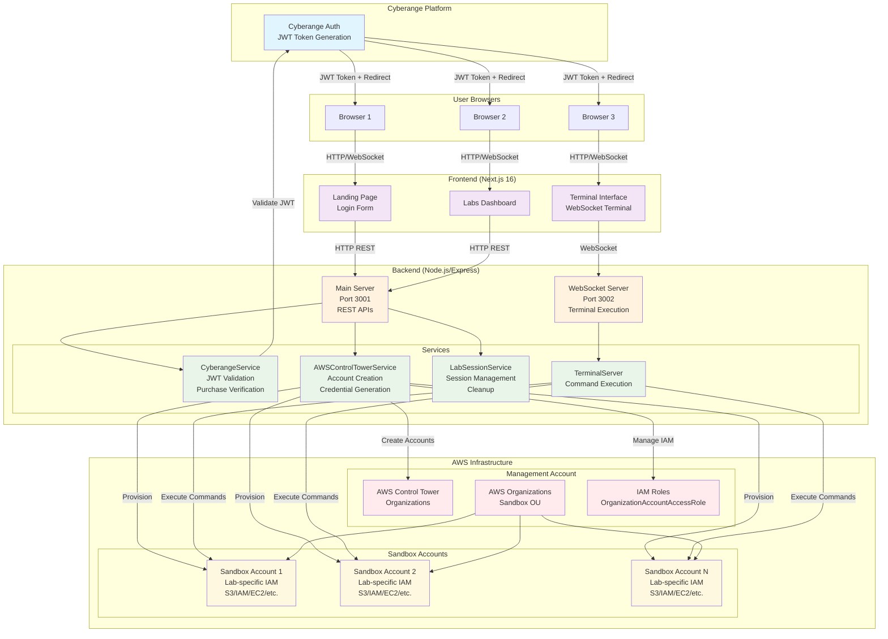

# AWS Security Labs Platform Architecture Diagram

## Diagram Explanation

### Components:
- **Cyberange Platform**: External authentication and purchase management system
- **Frontend**: Next.js application with login, dashboard, and terminal interfaces
- **Backend**: Express server handling REST APIs and WebSocket connections
- **Services**: Modular backend services for different functionalities
- **AWS Infrastructure**: Management account for orchestration and sandbox accounts for isolation

### Data Flow:
1. Users authenticate via Cyberange and receive JWT tokens
2. Frontend communicates with backend via HTTP and WebSocket
3. Backend validates tokens and manages lab sessions
4. AWS Control Tower creates isolated sandbox accounts per session
5. Commands execute in sandbox accounts with temporary credentials
6. Sessions auto-cleanup with account destruction

### Security Features:
- Per-user isolated AWS accounts
- Temporary credentials with auto-revocation
- JWT-based authentication
- Cost controls and monitoring

This diagram provides a high-level overview of the system architecture. For detailed component interactions, refer to the ARCHITECTURE.md file.
